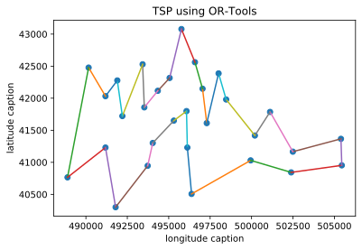
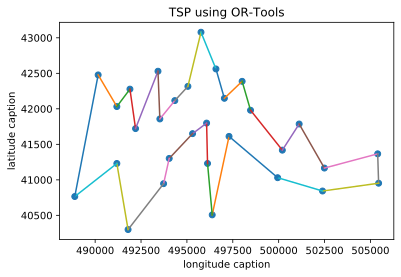

<!--
 * @Author: your name
 * @Date: 2020-07-23 10:35:16
 * @LastEditTime: 2020-07-24 15:56:08
 * @LastEditors: Please set LastEditors
 * @Description: In User Settings Edit
 * @FilePath: \szcup2020_simulation\README.md
--> 


深圳杯2020——数学建模模拟赛——C题
====

## 依赖库
- Google or-tools
- xlrd
- matplotlib
- sys
- numpy
- math
- sympy (符号计算)
## 计算公式
- 经度（东西方向）1M实际度：31544206M*cos(纬度)/360°=
  
  $31544206\cdot\cos(latitude=36)/360 = 708883.29m/longtitude$

- 纬度（南北方向）1M实际度：40030173M360°=

  $40030173/360 = 111194.92m/latitude$

## 第一题

#### 使用first solution strategy获得计算近似解
求得结果
```bash
Route:
Route:
 0 -> 10 -> 16 -> 27 -> 12 -> 8 -> 9 -> 15 -> 7 -> 11 -> 6 -> 14 -> 25 -> 18 -> 26 -> 19 -> 20 -> 1 -> 2 -> 17 -> 29 -> 21 -> 23 -> 24 -> 28 -> 22 -> 3 -> 4 -> 5 -> 13 -> 0
Distance: 39410m
```

#### 使用guided local search获得最优解
求得结果
```bash
Route:
 0 -> 29 -> 17 -> 2 -> 1 -> 20 -> 19 -> 26 -> 18 -> 25 -> 14 -> 6 -> 11 -> 7 -> 15 -> 9 -> 8 -> 12 -> 27 -> 16 -> 10 -> 13 -> 5 -> 4 -> 3 -> 22 -> 28 -> 24 -> 23 -> 21 -> 0
Distance: 39305m
```


## 第二问

要使传感器一直工作的最低要求：在移动电源走完一整个回路后，电池容量刚好达到最低要求为最优

假设初始条件：当到达该节点时，剩余电池容量刚好为最低要求

### 参数
  
- $x_1,x_2,\cdots,x_{30}$：假设每个节点的电池容量
- $r_1,r_2,\cdots,r_{30}$：每个节点的电池充电速度
- $c_1,c_2,\cdots,c_{30}$：每个节点的电池消耗速度
- $v(m/s)$：移动充电器移动速度
- $dst$：总路程

### 等式
- **时间总花费**：$t_{tot}=dst/v+\sum_{i=1}^{30}{(x_i - f)/r_i}$
- **电池容量推导**：$x_i=t_{tot}\cdot c_i+f$

### 约束条件
$$x_{i} = [dst/v+\sum_{i=1}^{30}{(x_{i} - f)/r_i}]\cdot c_i+f$$

### 根据约束条件得出线性方程组
组合结果：
$$
\left[ \begin{array}{l}
	\boldsymbol{x}_1\\
	\vdots\\
	\boldsymbol{x}_{30}\\
\end{array} \right] =\left[ \begin{array}{c}
	\frac{\boldsymbol{dst}\cdot \boldsymbol{c}_1}{\boldsymbol{v}}\\
	\vdots\\
	\frac{\boldsymbol{dst}\cdot \boldsymbol{c}_{30}}{\boldsymbol{v}}\\
\end{array} \right] +\left[ \begin{array}{c}
	\boldsymbol{f}\\
	\vdots\\
	\boldsymbol{f}\\
\end{array} \right] +\left[ \begin{array}{c}
	\frac{\boldsymbol{x}_1\cdot \boldsymbol{c}_1-\boldsymbol{f}\cdot \boldsymbol{c}_1}{\boldsymbol{r}_1}+\cdots +\frac{\boldsymbol{x}_{30}\cdot \boldsymbol{c}_{30}-\boldsymbol{f}\cdot \boldsymbol{c}_{30}}{\boldsymbol{r}_{30}}\\
	\vdots\\
	\frac{\boldsymbol{x}_1\cdot \boldsymbol{c}_1-\boldsymbol{f}\cdot \boldsymbol{c}_1}{\boldsymbol{r}_1}+\cdots +\frac{\boldsymbol{x}_{30}\cdot \boldsymbol{c}_{30}-\boldsymbol{f}\cdot \boldsymbol{c}_{30}}{\boldsymbol{r}_{30}}\\
\end{array} \right] 
$$
化简：
$$
\left[ \begin{array}{l}
	\boldsymbol{x}_1\\
	\vdots\\
	\boldsymbol{x}_{30}\\
\end{array} \right] =\left[ \begin{array}{c}
	\frac{\boldsymbol{dst}\cdot \boldsymbol{c}_1}{\boldsymbol{v}}+\boldsymbol{f}-\frac{\boldsymbol{f}\cdot \boldsymbol{c}_1}{\boldsymbol{r}_1}-\cdots -\frac{\boldsymbol{f}\cdot \boldsymbol{c}_{30}}{\boldsymbol{r}_{30}}\\
	\vdots\\
	\frac{\boldsymbol{dst}\cdot \boldsymbol{c}_{30}}{\boldsymbol{v}}+\boldsymbol{f}-\frac{\boldsymbol{f}\cdot \boldsymbol{c}_1}{\boldsymbol{r}_1}-\cdots -\frac{\boldsymbol{f}\cdot \boldsymbol{c}_{30}}{\boldsymbol{r}_{30}}\\
\end{array} \right] +\left[ \begin{array}{c}
	\frac{\boldsymbol{x}_1\cdot \boldsymbol{c}_1}{\boldsymbol{r}_1}+\cdots +\frac{\boldsymbol{x}_{30}\cdot \boldsymbol{c}_{30}}{\boldsymbol{r}_{30}}\\
	\vdots\\
	\frac{\boldsymbol{x}_1\cdot \boldsymbol{c}_1}{\boldsymbol{r}_1}+\cdots +\frac{\boldsymbol{x}_{30}\cdot \boldsymbol{c}_{30}}{\boldsymbol{r}_{30}}\\
\end{array} \right] 
$$
