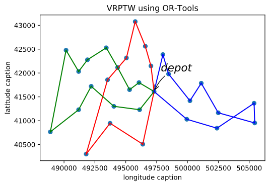

<!--
 * @Author: your name
 * @Date: 2020-07-13 10:35:16
 * @LastEditTime: 2020-08-03 09:29:04
 * @LastEditors: Please set LastEditors
 * @Description: In User Settings Edit
 * @FilePath: \szcup2020_simulation\README.md
--> 


深圳杯2020——数学建模模拟赛——C题
====

## 依赖库
- Google or-tools
- xlrd
- matplotlib
- sys
- numpy
- math
- sympy (符号计算)
- - geopy（经纬度换算）
## 计算公式
### 感谢大神指点，原方案的经纬度换算有问题，故换成`geopy`库来解决
### 正确版本
```python
def compute_euclidean_distance_matrix(locations):
    distances = {}
    for fromCounter, fromNode in enumerate(locations):
        distances[fromCounter] = {}
        for toCounter, toNode in enumerate(locations):
            if fromCounter == toCounter:
                distances[fromCounter][toCounter] = 0
            else:
                distances[fromCounter][toCounter] = geodesic(fromNode, toNode).meters
    return distances
```
### 先前错误版本
- 经度（东西方向）1M实际度：31544206M*cos(纬度)/360°=
  
  $31544206\cdot\cos(latitude=36)/360 = 708883.29m/longtitude$

- 纬度（南北方向）1M实际度：40030173M360°=

  $40030173/360 = 111194.92m/latitude$

## 第一题

#### 使用first solution strategy获得计算近似解
求得结果


```bash
Route:
 0 -> 2 -> 1 -> 9 -> 7 -> 6 -> 11 -> 14 -> 15 -> 27 -> 16 -> 13 -> 12 -> 8 -> 10 -> 5 -> 3 -> 28 -> 24 -> 23 -> 29 -> 26 -> 25 -> 18 -> 19 -> 20 -> 17 -> 21 -> 22 -> 4 -> 0
Distance: 12033m
```

#### 使用guided local search获得最优解
求得结果


```bash
Route:
 0 -> 2 -> 1 -> 9 -> 7 -> 6 -> 14 -> 11 -> 8 -> 12 -> 15 -> 27 -> 16 -> 13 -> 10 -> 5 -> 3 -> 4 -> 22 -> 28 -> 24 -> 23 -> 21 -> 29 -> 26 -> 25 -> 18 -> 19 -> 20 -> 17 -> 0       
Distance: 11469m
```

## 第二问：数值解法（numerical）

要使传感器一直工作的最低要求：在移动电源走完一整个回路后，电池容量刚好达到最低要求为最优

假设初始条件：当到达该节点时，剩余电池容量刚好为最低要求

### 参数定义
  
- $x_1,x_2,\cdots,x_{30}$：假设每个节点的电池容量
- $c_1,c_2,\cdots,c_{30}$：每个节点的电池消耗速度
- $r(mA/s)$：电池充电速度
- $f$：最低工作电量
- $v(m/s)$：移动充电器移动速度
- $dst$：总路程

### 等式
- **时间总花费**：$t_{tot}=dst/v+\sum_{i=1}^{30}{(x_i - f)/r_i}$
- **电池容量推导**：$x_i=t_{tot}\cdot c_i+f$

### 约束条件
去掉数据中心节点的充电计算

$$x_{i} = [dst/v+\sum_{i=2}^{30}{(x_{i} - f)/r_i}]\cdot c_i+f$$

### 根据约束条件得出线性方程组
组合结果为一个29*29的矩阵：

$$
\left[ \begin{array}{l}
	\boldsymbol{x}_2\\
	\vdots\\
	\boldsymbol{x}_{30}\\
\end{array} \right] =\left[ \begin{array}{c}
	\frac{\boldsymbol{dst}\cdot \boldsymbol{c}_2}{\boldsymbol{v}}+\boldsymbol{f}-\frac{\boldsymbol{f}\cdot \boldsymbol{c}_2}{\boldsymbol{r}}-\cdots -\frac{\boldsymbol{f}\cdot \boldsymbol{c}_{30}}{\boldsymbol{r}}\\
	\vdots\\
	\frac{\boldsymbol{dst}\cdot \boldsymbol{c}_{30}}{\boldsymbol{v}}+\boldsymbol{f}-\frac{\boldsymbol{f}\cdot \boldsymbol{c}_2}{\boldsymbol{r}}-\cdots -\frac{\boldsymbol{f}\cdot \boldsymbol{c}_{30}}{\boldsymbol{r}}\\
\end{array} \right] +\left[ \begin{array}{c}
	\frac{\boldsymbol{x}_2\cdot \boldsymbol{c}_2}{\boldsymbol{r}}+\cdots +\frac{\boldsymbol{x}_{30}\cdot \boldsymbol{c}_{30}}{\boldsymbol{r}}\\
	\vdots\\
	\frac{\boldsymbol{x}_2\cdot \boldsymbol{c}_2}{\boldsymbol{r}}+\cdots +\frac{\boldsymbol{x}_{30}\cdot \boldsymbol{c}_{30}}{\boldsymbol{r}}\\
\end{array} \right] 
$$


化简：

$$
\left[ \begin{array}{l}
	\boldsymbol{x}_2\\
	\vdots\\
	\boldsymbol{x}_{30}\\
\end{array} \right] =\left[ \begin{array}{c}
	\frac{\boldsymbol{dst}\cdot \boldsymbol{c}_2}{\boldsymbol{v}}+\boldsymbol{f}-\frac{\boldsymbol{f}\cdot \boldsymbol{c}_2}{\boldsymbol{r}_2}-\cdots -\frac{\boldsymbol{f}\cdot \boldsymbol{c}_{30}}{\boldsymbol{r}_{30}}\\
	\vdots\\
	\frac{\boldsymbol{dst}\cdot \boldsymbol{c}_{30}}{\boldsymbol{v}}+\boldsymbol{f}-\frac{\boldsymbol{f}\cdot \boldsymbol{c}_2}{\boldsymbol{r}_2}-\cdots -\frac{\boldsymbol{f}\cdot \boldsymbol{c}_{30}}{\boldsymbol{r}_{30}}\\
\end{array} \right] +\left[ \begin{array}{c}
	\frac{\boldsymbol{x}_2\cdot \boldsymbol{c}_2}{\boldsymbol{r}_2}+\cdots +\frac{\boldsymbol{x}_{30}\cdot \boldsymbol{c}_{30}}{\boldsymbol{r}_{30}}\\
	\vdots\\
	\frac{\boldsymbol{x}_2\cdot \boldsymbol{c}_2}{\boldsymbol{r}_2}+\cdots +\frac{\boldsymbol{x}_{30}\cdot \boldsymbol{c}_{30}}{\boldsymbol{r}_{30}}\\
\end{array} \right] 
$$

转化成$A\cdot X = b$形式：

$$
\left[ \begin{matrix}
	\frac{\boldsymbol{c}_2}{\boldsymbol{r}}-1&		\cdots&		\frac{\boldsymbol{c}_{30}}{\boldsymbol{r}}\\
	\vdots&		\ddots&		\vdots\\
	\frac{\boldsymbol{c}_2}{\boldsymbol{r}}&		\cdots&		\frac{\boldsymbol{c}_{30}}{\boldsymbol{r}}-1\\
\end{matrix} \right] \cdot \left[ \begin{array}{l}
	\boldsymbol{x}_2\\
	\vdots\\
	\boldsymbol{x}_{30}\\
\end{array} \right] =-\left[ \begin{array}{c}
	\frac{\boldsymbol{dst}\cdot \boldsymbol{c}_2}{\boldsymbol{v}}+\boldsymbol{f}-\frac{\boldsymbol{f}\cdot \boldsymbol{c}_2}{\boldsymbol{r}}-\cdots -\frac{\boldsymbol{f}\cdot \boldsymbol{c}_{30}}{\boldsymbol{r}}\\
	\vdots\\
	\frac{\boldsymbol{dst}\cdot \boldsymbol{c}_{30}}{\boldsymbol{v}}+\boldsymbol{f}-\frac{\boldsymbol{f}\cdot \boldsymbol{c}_2}{\boldsymbol{r}}-\cdots -\frac{\boldsymbol{f}\cdot \boldsymbol{c}_{30}}{\boldsymbol{r}}\\
\end{array} \right] 
$$


其中 


$$
\boldsymbol{A}=\left[ \begin{matrix}
	\frac{\boldsymbol{c}_2}{\boldsymbol{r}}-1&		\cdots&		\frac{\boldsymbol{c}_{30}}{\boldsymbol{r}}\\
	\vdots&		\ddots&		\vdots\\
	\frac{\boldsymbol{c}_2}{\boldsymbol{r}}&		\cdots&		\frac{\boldsymbol{c}_{30}}{\boldsymbol{r}}-1\\
\end{matrix} \right] ，
\boldsymbol{b}=-\left[ \begin{array}{c}
	\frac{\boldsymbol{dst}\cdot \boldsymbol{c}_2}{\boldsymbol{v}}+\boldsymbol{f}-\frac{\boldsymbol{f}\cdot \boldsymbol{c}_2}{\boldsymbol{r}}-\cdots -\frac{\boldsymbol{f}\cdot \boldsymbol{c}_{30}}{\boldsymbol{r}}\\
	\vdots\\
	\frac{\boldsymbol{dst}\cdot \boldsymbol{c}_{30}}{\boldsymbol{v}}+\boldsymbol{f}-\frac{\boldsymbol{f}\cdot \boldsymbol{c}_2}{\boldsymbol{r}}-\cdots -\frac{\boldsymbol{f}\cdot \boldsymbol{c}_{30}}{\boldsymbol{r}}\\
\end{array} \right] 
$$

### 参数设置
1. 速度$v=50m/s$
2. 充电速度$r = 200mA/s$
3. 最低工作值$f=10mA$

### 数值解结果
| nodes | battery capacity |
|:-----:|------------------|
|   0   | 5145.627         |
|   1   | 5692.659         |
| 2     | 4940.490         |
| 3     | 5168.420         |
| 4     | 4735.353         |
| 5     | 4940.490         |
| 6     | 5373.557         |
| 7     | 4963.283         |
| 8     | 4940.490         |
| 9     | 5168.420         |
| 10    | 4940.490         |
| 11    | 5601.487         |
| 12    | 5396.350         |
| 13    | 4940.490         |
| 14    | 4780.939         |
| 15    | 4940.490         |
| 16    | 5168.420         |
| 17    | 5624.280         |
| 18    | 5168.420         |
| 19    | 4940.490         |
| 20    | 4712.560         |
| 21    | 5168.420         |
| 22    | 5624.280         |
| 23    | 4712.560         |
| 24    | 5168.420         |
| 25    | 4894.904         |
| 26    | 4735.353         |
| 27    | 5373.557         |
| 28    | 5145.627         |


## 第二问：符号解法（symbolic）

代码已经实现，但是矩阵渲染太大导致计算机崩溃，故此可以得出利用符号解求解该问题并没有意义。


## 第三问

### 标准模型
由于有多辆车进行运送，要是以最小化路径为目标函数，可能会造成某辆车的运送时间过长而导致总时间并不是最短的。所以目标函数应为：若设车队的运送时间为$T = {t_1,t_2,t_3,t_4}$，车队的运输路径长度$L = {l_1, l_2, l_3, l_4}$。则最小化$T$中最大的值，也可以解释为最小化$T$中的最大值。综上所述，该问为有时间窗车辆路径问题（vehicle routing problems with time windows）。
$$
\min \left\{ \max \left\{ \boldsymbol{t}_1,\boldsymbol{t}_2,\boldsymbol{t}_3,\boldsymbol{t}_4 \right\} \right\} 
$$

### 方法一
#### 参数设置
1. 速度：$v=100m/s$
2. 每辆车最多运行时间：$180s$
3. 每个节点的时间窗：$[0, 39305 / 100 / 2]$

#### 运行结果
```
Route for vehicle 0:
0 Time(0,0) -> 0 Time(0,0)
Time of the route: 0 seconds

Route for vehicle 1:
0 Time(0,0) -> 10 Time(5,5) -> 16 Time(11,11) -> 27 Time(20,20) -> 12 Time(30,30) -> 9 Time(45,45) -> 26 Time(68,68) -> 19 Time(88,88) -> 29 Time(114,114) -> 0 Time(128,128)
Time of the route: 128 seconds

Route for vehicle 2:
0 Time(0,0) -> 2 Time(12,12) -> 1 Time(19,19) -> 8 Time(29,29) -> 15 Time(39,39) -> 11 Time(54,54) -> 6 Time(61,61) -> 14 Time(72,72) -> 25 Time(93,93) -> 18 Time(116,116) -> 7 Time(127,127) -> 20 Time(145,145) -> 17 Time(165,165) -> 0 Time(177,177)
Time of the route: 177 seconds

Route for vehicle 3:
0 Time(0,0) -> 21 Time(27,27) -> 23 Time(51,51) -> 28 Time(81,81) -> 24 Time(85,85) -> 22 Time(114,114) -> 3 Time(129,129) -> 4 Time(138,138) -> 5 Time(156,156) -> 13 Time(162,162) -> 0 Time(172,172)
Time of the route: 172 seconds
Maximum time : 172 seconds
```


#### 缺点分析
1. 少了一辆车，不会是最优解